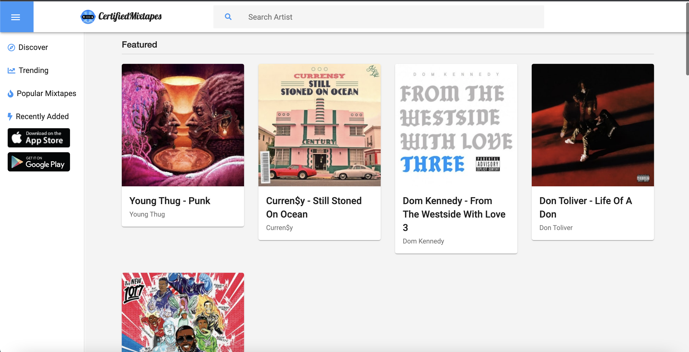
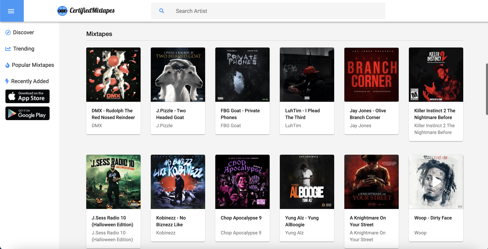
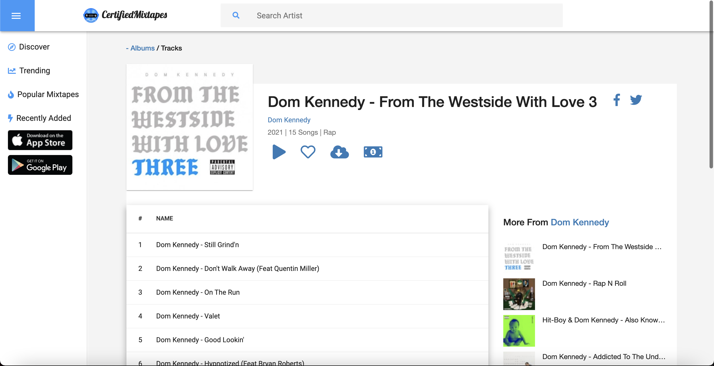
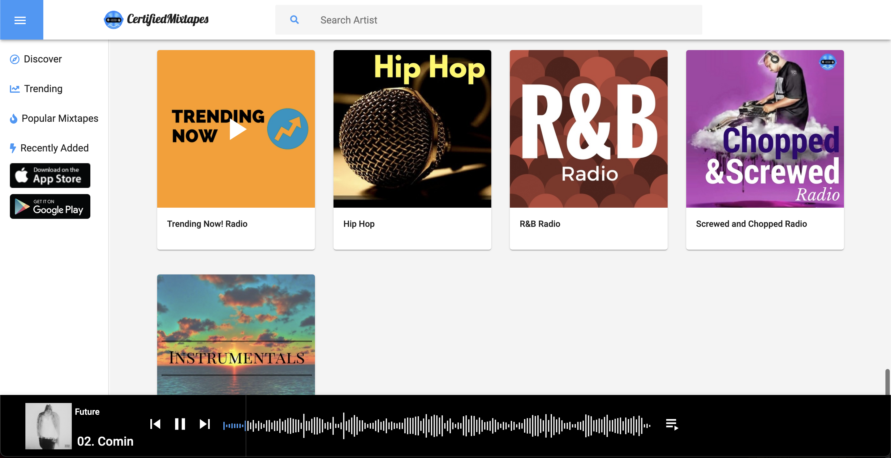

# Certified Mixtapes

The objective of this project is to isolate our visual layer of our application from the core backend functionality. The current [certifed mixtapes]() is a MVC application created in asp.net core 3.1. This project was created in angular.

Cloudflare workers was implemented to serve the application from the edge for faster load times and a better experience from any location.

Prototype: https://www.certifiedmixtapes.com

## Libraries

[wavesurfer js](https://wavesurfer-js.org/) 
[Angular 12](https://angular.io/) 

Hosted in [Cloudflare Pages](https://pages.cloudflare.com/) 
API Proxy [Cloudflare Workers](https://workers.cloudflare.com/)

[#DeveloperChallenge](https://twitter.com/hashtag/developerchallenge)
